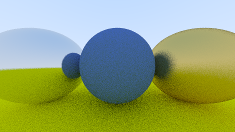

# A raytracer in Skarn

A path tracer along the lines of *Ray Tracing in One Weekend*: spheres, a field-of-view
camera, matte and metal materials, recursive bounces with a depth limit, and antialiasing
by supersampling. It writes a 24-bit BMP.



It exists to **find out what writing a real Skarn program is like**, not to render pictures.
Most small test programs are front-end-shaped: recursive datatypes, `match`, `Int`, traits.
This one is deliberately the opposite shape: floating-point maths, `Array[Double]`, `Bytes`
as a real binary format, and tight numeric loops. The picture is the evidence that the
program is real.

## Running

```
static_vmrun demo/raytracer/main.skn
```

| Flag | Effect |
|---|---|
| *(none)* | 470×264, 16 samples/pixel, depth 12 — under a minute, writes `raytracer.bmp` |
| `--preview` | 160×90, 4 samples — about two seconds. The form to use as a build gate |
| `--fast` | use the scalar-inlined intersection kernel instead of the idiomatic one |
| `--inlined` | use the compiler-style kernel: calls replaced by their bodies, objects kept |
| `--quiet` | skip the self-tests, so a timing run measures only the render |
| `--threads=N` | render on N parallel tasks (`std::task`); the default 1 renders on the main thread. The image is identical for every N |

The output file lands in the **current directory**, not next to the source.

## It is its own regression test

The renderer is deterministic. There is one seed, and row y draws from its own random stream,
seeded with `SEED + y`. A row's pixels therefore do not depend on which task renders it, or on
which rows were rendered before it, and a given configuration produces one exact file for any
`--threads`. `main.skn` pins that file's CRC-32 and checks it, and a mismatch `panic`s, which
means a **non-zero exit code**. So this is gate-able:

```
static_vmrun demo/raytracer/main.skn --preview
```

is a ~2 second check that exits 0 only if all 40-odd self-tests pass *and* every pixel is
where it was. The same comparison covers the three intersection kernels against each other,
and a parallel render against the sequential one: all must reach the identical checksum.

If a deliberate change moves the image, re-pin `CRC_PREVIEW` **and** `CRC_FULL` together.

## Layout

Modules are ordered by dependency; Skarn's module graph must be acyclic, which shaped the
design in one visible place (see `material.skn`).

| File | Contents |
|---|---|
| `vec3.skn` | `Vec3` — the vector and colour type, plus `asDouble` |
| `ray.skn` | `Ray` — origin, direction, `at(t)` |
| `bmp.skn` | `Canvas` and the 24-bit BMP encoder. Knows nothing about `Vec3` or colour |
| `material.skn` | `trait Material`, `Lambertian`, `Metal`, random directions |
| `hittable.skn` | `trait Hittable`, `Hit`, `Sphere`, `FastSphere`, `InlinedSphere`, scene traversal |
| `camera.skn` | `Camera` — field of view, orientation, ray generation |
| `main.skn` | self-tests, scene, render loop, measurement, self-check |
| `raytracer.py` | a faithful CPython port, for the comparison below |

## Verification, in layers

Rendering bugs are hard to unit-test and easy to see, so the program checks each layer on
its own **before** the picture exists — a wrong image can then be blamed on one thing at a
time:

1. **`Vec3`** — 13 identities, exact arithmetic.
2. **BMP** — a 3×2 image checked *byte by byte* against hand-computed values, covering the
   three details that silently break a BMP: bottom-up row order, BGR (not RGB) pixels, and
   4-byte row padding.
3. **Sphere intersection** — hit in front, miss, hit behind the eye (rejected by the
   interval, not the algebra), hit from *inside* (the far root, with a flipped normal), and
   nearest-wins across a scene.
4. **Camera** — the viewport corners at a known field of view, with an epsilon: `tan(45°)`
   is `0.9999999999999999`, so exact comparison is wrong here.
5. **Materials** — unit directions, that `mut rng` really advances the *caller's* stream,
   albedo, 45° mirror reflection, absorption of rays scattered into the surface, and that
   one seed replays one stream.

Beyond that, the rendered images were decoded with an independent reader (`System.Drawing`)
and sampled against separately hand-computed colours.

## What it measures

Measured on an AMD Ryzen 5 5600H, Release x64, at the full size (470×264 × 16 samples ≈ 2.0 M
primary rays), with inlining switched off (`static_vmrun --no-inline`). Your machine will
differ; the ratios are the interesting part.

| | idiomatic `Sphere` | `--fast` `FastSphere` |
|---|---|---|
| wall | 40.3 s | 36.4 s |
| ns per primary ray | 20 284 | 18 331 |
| allocated | 3229 MiB | 2330 MiB |
| collections | 1059 | 764 |
| GC share of wall | 0.50 % | 0.43 % |

With inlining on, which is the default, the idiomatic kernel runs about 9 % faster again.

### Against CPython

`raytracer.py` is a faithful CPython port: the same xoshiro128\*\* generator, the same draw
order, the same BMP. It reproduces the pinned CRC-32 and exits non-zero on a mismatch, so the
two programs provably perform the same computation and the timings compare languages rather
than pictures:

```
python demo/raytracer/raytracer.py --preview
```

Same machine, same 2.0 M rays, runs interleaved:

| | wall | µs per primary ray | vs Skarn (idiomatic) |
|---|---|---|---|
| **Skarn** (idiomatic) | 40.3 s | 20.3 | — |
| **Skarn** (`--fast`) | 36.4 s | 18.3 | — |
| CPython 3.11.8 | 96.6 s | 48.7 | Skarn **2.40× faster** |
| CPython 3.6.0 | 155.2 s | 78.2 | Skarn **3.85× faster** |

This is a more honest number than a loop microbenchmark. The workloads in
`demo/bench/bench.skn` range from far ahead of CPython to behind it, depending on how much of
the work CPython hands to C. A real program, dominated by method calls on small short-lived
objects, lands in between.

### On several cores

`--threads=N` renders on N fork-join tasks (`std::task`). Each task runs `renderRows` on its own thread
and heap. It receives a small job — which rows, the image size, the kernel — and returns its rows as
packed pixels. The job is plain data because the argument is copied into the task's heap. For the same
reason each task builds the four-sphere scene itself: the scene holds `dyn` values, which cannot be sent.
Task k takes rows k, k+N, k+2N, …, because the sky rows at the top are much cheaper than the ground rows.
Equal bands would leave some tasks idle.

Same machine, full size, inlining on, three interleaved rounds (median / best):

| tasks | render | speedup |
|---|---|---|
| none (main thread) | 28.1 s / 26.9 s | — |
| 2 | 14.9 s / 13.9 s | 1.9× / 1.9× |
| 4 | 10.1 s / 8.9 s | 2.8× / 3.0× |
| 6 | 9.2 s / 8.0 s | 3.1× / 3.3× |
| 12 | 8.0 s / 6.8 s | 3.5× / 3.9× |

The 5600H has six cores and twelve hardware threads. Two tasks scale almost perfectly. After that the
curve flattens, because the clock drops as more cores are busy and a hyperthread adds much less than a core.
The laptop also slowed down from round to round, which is why the best-of-three column is the fairer one.
Every run reproduced the pinned checksum. Each task adds about 8 MB of memory: its own heap and stacks.

### What the kernels show

The three kernels compute the same image bit for bit, so their differences are pure cost:

- **`--fast`** writes the intersection on scalar locals. It is about 10 % faster. Counting the
  executed instructions of both kernels, the ones it removes are 57 % call machinery (calls,
  returns, argument moves), 30 % field reads and 13 % allocation. The price of the readable
  vector API is calls and field reads, not the heap.
- **`--inlined`** replaces every direct call in `Sphere.hit` with its body and changes nothing
  else: every intermediate `Vec3` is still allocated and every field still read. It is about
  5 % faster, which is the share an inliner can take from that one function. The compiler's
  own inliner works program-wide, standard library included, and gains more.

The idiomatic kernel stays the default: 10 % does not buy back that code.

**A copying collector is cheap on young garbage.** 3.2 GB allocated in 40 seconds costs half
a percent of the wall time, because the collector copies only survivors (see "Heap and garbage
collector" in [VirtualMachine.md](../../docs/VirtualMachine.md)).
